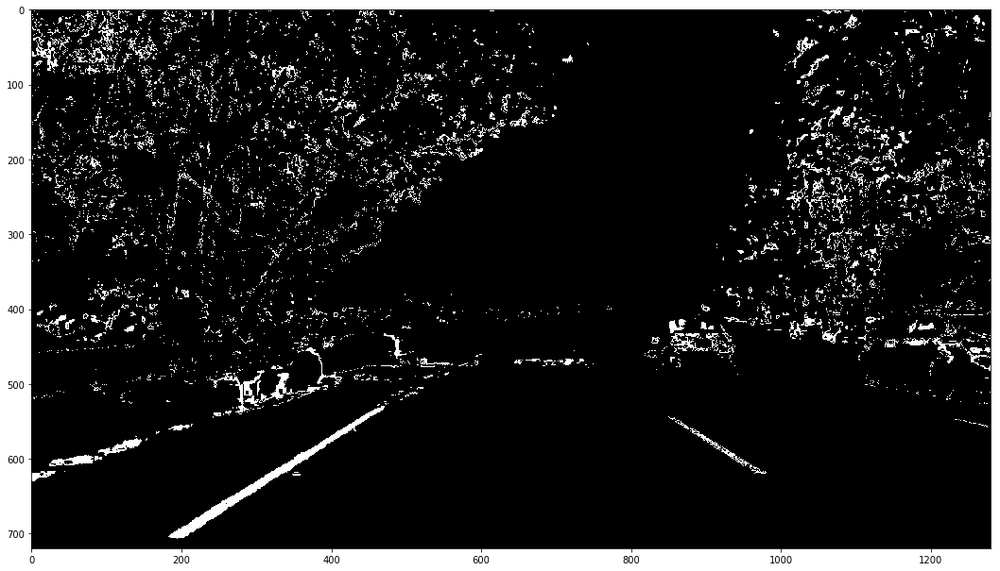

Omar Benzakour
---

# Self-Driving Car Engineer Nanodegree

## Project: **Advanced Lane FInding** 
The goals / steps of this project are the following:

* Compute the camera calibration matrix and distortion coefficients given a set of chessboard images.
* Apply a distortion correction to raw images.
* Use color transforms, gradients, etc., to create a thresholded binary image.
* Apply a perspective transform to rectify binary image ("birds-eye view").
* Detect lane pixels and fit to find the lane boundary.
* Determine the curvature of the lane and vehicle position with respect to center.
* Warp the detected lane boundaries back onto the original image.
* Output visual display of the lane boundaries and numerical estimation of lane curvature and vehicle position.

The following readme file corresponds to the outputs of the jupyter notebook cells that can be find at the root of the repo.

## Original image

In this project we will apply a series of transformation to the image, we will therefore start by displaying the original image

## Camera calibration

In the follwing cells we will define an undistort function. This function will take a distorted image and output an undistorted image. It is, of course, assumed that the image you feed into this function is taken from the same camera that took the chessboard images. 
In order to undistord the image we will take different images of a chessboard from different angles and distances. Then, we will apply the cv2.findChessboardCorners function to get the position of the image points. To these image point we will associate its coordinates in the chessboard coordiante system. Using these points we will be able to invoke the cv2.calibrateCamera to get the camera's distorsion matrix. 
we will therefore be able to call the cv2.undistord function to undistord an image taken by the camera. Is our calibration successfull ?

Let us now undistort the road image

we can see that some part of the distorted parts of the image have been cropped (top and bottom right corners) because they were distorted

## Binary image

We can now undistort the images coming from our camera. In this section we will take these undistorted images and
output a binary images containing the lines on the road.
We will use 2 different techniques to achieve this:

   1. The RGB color model is not the most convenient to use for filtering because it doesn't allow us to simply select the different variations of a color, HLS color model is better suited for this. The first step is therefore to convert the image's RGB colors to HLS colors and apply to it a color filter (treshold over the S value). We will use the S channel and apply to it the filtering. Indeed, the S channel is better suited for this color filtering because the concrete is greyish while the lines are colorful (high saturation)
   2. In order to select the white lanes from this image, we will have to use to sobel operator. Indeed, the sobel operator allows us to compute the derivative of a gray image according to the x and y axis. We will then compute thanks to these values the magnitude and angle vector of the derivative vector for each pixel . We will then apply a filter to the pixels of the image according to the magnitude, angle, value of the sobel according the x and y axes. Because shadow lines are mistakenly taken lanes we will use a mask and discard the rest of the image but a small polygon centered on the road

### Using colors for filtering

### Using The sobel operator for filtering

## Combining both masks

## Perspective image

We will now use an image where the lines are vertical to get good points for the perspective transform.
Then, we will use the cv2.warpPerspective to obtain a perspective transform of the road

Let us do the same for the mask we computed

## Identification of the pixels that constitute the lines

Now that we have a perspective transform of a binary image, we need to identify which pixels belong to which line.
At first we will define a sliding window search function that will identify the pixels that constitute the lines, then we will look for the pixels constituting the lines assuming we have 2 polynoms that represent x = f(y) for each lines

### Finding lines thanks to the sliding window function

We can therefore clearly identify the start of of each line. The right line is less "intense" than the right one because it is not a continous line

### Assuming we have x = f(y)  for each line

Since we have now a function representing the line we can use this information the next frame, let us suppose we have now another image ( the one that follows the previous one ) and let us see the pixels we will take into account.
Of course this supposition holds because the images we exctract from the camera are regularly and closely spaced

## Let's build the get_line_pixels function

Let us merge the work we did before, we will get the following function, in case the polynoms represented the left and right lanes are provided we will use the second method. Otherwise we will use the first one

### Let us check that our function works properly

## Measuring the curvature and the deviation of the midpoint of the lane

We have now the the x = f(y) function, we can now, after translating this function from the pixels space to the real (metres), compute the curvature of the road ( given by the formula )

### process image function and using it on a video

Let us now draw the lines on the original and undistorted image. In case the curvature radius of the a line is inferior to 600m  we will use the previous polynoms. We can afford to do this because badly identified frames are pretty rare with our implementation. In case of a harder circuit we will need to implement a recovery system that will recompure the polynoms using the sliding windows

## Test on Videos

We can test now our solution on the provided video
Let's try the one with the solid white lane on the right first ...

<video width="960" height="540" controls>
  <source src="./project_video_result.mp4">
</video>

## Conclusion and discution

In this project we built a pipeline to detect lanes. This solution is better than the first project in many points.This implementation is however not perfect and several improvements can be made :

1. Currently if the radius of curvature is less than 600 m, we discard the lane measurement and use the previous one. This fallback works well in our case because bad frames are not that common so that our algorithm can get quickly back on his feet.
2. Shadows are a real nightmare for our pipeline. Indeed, when applying the sobel transform to our image, shadow lanes are detected as lanes. To prevent this effect I have applied after the sobel operator a mask that turns everything outside the region of interest to 0. I really wonder how our pipeline will behave in case the road crosses a forest with high trees generating discontinued shadows
3. Neighboring cars can easily perturb our pipeline, particularly if they have some shiny color. Indeed the detection of the start of the line using the histogram will be wrong
4. In the current implementation, we only use the sliding window at the beginning. In case a car gets in our way at that moment, it will take a lot of time to our system to recover because we will not use the sliding window but keep on using the previous fitted polynomials and look at the neighboring pixels
